# SCORE Deploy Guide
이 문서는 ICON 네트워크에서 SCORE(Smart Contract on Reliable Environment)를 배포하는 방법에 대해 설명한다.
| 일시 | 버전 | 작성자 | 비고 |
|:-----|:-----:|:-----:|:----|
| 2018.08.22 | 0.1 | 신영미 | 최초 작성 |

SCORE의 배포는 tbears를 통해 가능하며, DAPP 개발자는 수수료를 지불할 수 있는 지갑이 필요하다. 한번 배포 완료된 SCORE의 갱신은 동일한 지갑 주소로만 가능하다.

ICON 네트워크 상에서 동작하는 SCORE는 의도적으로 혹은 실수에 의해 ICON 네트워크를 공격할 수 있다. ICON 네트워크는 소수에 의해 다수가 공격당하는 현상을 사전에 막기 위해 SCORE audit과정을 포함하였다. SCORE audit은 ICON MainNet에서만 이루어진다.

ICON 네트워크의 auditor(s)은 DAPP 개발자가 deploy한 SCORE 위험성 여부를 사전 조사하여 SCORE를 accept 또는 reject 하며, auditor가 accept한 SCORE만 ICON 네트워크 상에서 동작할 수 있다.

다음은 SCORE의 상태 diagram이다. DAPP 개발자가 tbears를 통해 SCORE를 deploy하면, 해당 SCORE는 ICON 네트워크 상에서 Pending 상태로 등록된다. 이 상태에서는 SCORE가 동작하지 않으며, ICON 네트워크의 auditor를 통해서 accept가 된 이후에야 동작하게 된다. ICON 네트워크에 위협을 가할 만하다고 판단되면, auditor는 해당 SCORE를 reject 할수 있다. 한번 active된 SCORE는 필요한 경우 동일한 DAPP 개발자(동일한 지갑)에 의해 deploy update가 가능하며, update된 SCORE의 accept가 이뤄질 때까지 이전 SCORE가 호출되게 된다.

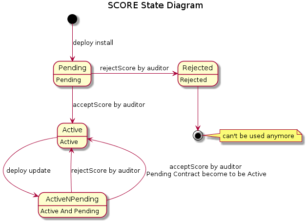

## Preparation
DAPP 개발자가 SCORE를 deploy하기 위해서는 수수료를 지불할만큼의 잔액이 있는 지갑을 소유해야 한다.

### tbears
[ICON SCORE development suite (tbears) TUTORIAL](https://icondev.io/gettingStart01.do)을 참조하여 설치한다.

### Wallet
Deploy할 때 사용하는 지갑은 ICONex에서 만들수 있다.
ICONex는 [https://icon.foundation/](https://icon.foundation/)의 wallet 메뉴로 진입하여 chrome extension 형식으로 설치한다. 지갑을 생성하고, deploy 때 수수료로 사용할 일정 금액을 예치하여 둔다.
ICONex의 Backup wallet 메뉴로 백업한 keystore 파일은 tbears에서 deploy할 때 사용한다.
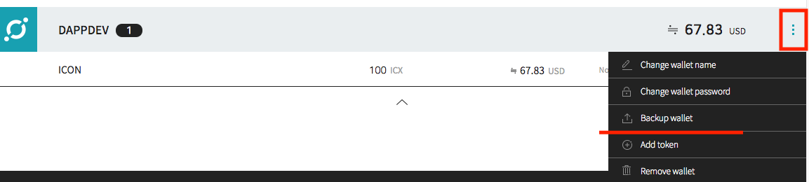

지갑은 tbears에서 직접 생성할 수도 있는데, 이 경우 ICONex에  등록할 수 있다.

```bash
(work) $ tbears keystore key_DAPPDEV.txt

input your key store password:

Made keystore file successfully

```
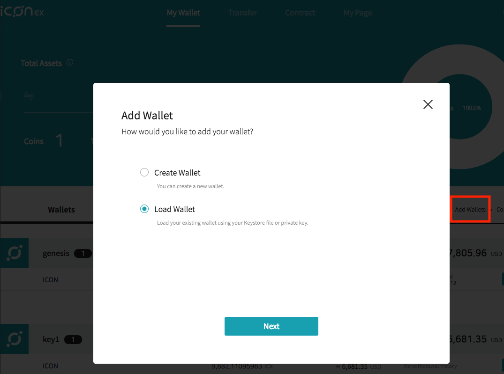

### tracker
ICON 네트워크는 블록과 transaction의 상태를 조회할 수 있는 시스템인 tracker(https://tracker.icon.foundation/)를 제공한다. tracker를 사용하여 DAPP 개발자는 SCORE의 상태를 조회 할 수 있다.
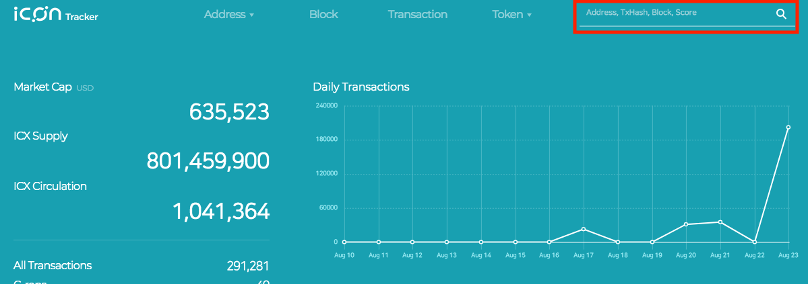

##deploy

### tbears deploy install
tbears config 파일(tbears_cli_config.json)의 uri와 keyStore, contentType, mode를 확인한다.
uri에는 MainNet의 uri를 keyStore에는 deploy 개발자의 keystore 파일을 설정한다.

```text
{
"uri": "http://wallet.icon.foundation:9000/api/v3",
"nid": "0x3",
"keyStore": "key_DAPPDEV.txt",
"from": "hxaaaaaaaaaaaaaaaaaaaaaaaaaaaaaaaaaaaaaaaa",
"to": "cx0000000000000000000000000000000000000000",
"stepLimit": "0x300000",
"deploy": {
    "contentType": "zip",
    "mode": "install",
    "scoreParams": {}
},
"txresult": {},
"transfer": {}
}

```
원하는 SCORE를 deploy한다. 아래는 "abc"라는 SCORE를 deploy하였다.
```bash
(work) $ tbears deploy abc

input your key store password:

Send deploy request successfully.

transaction hash: 0x469fce37cf1e7fb9892e1333a15d4e20f86e8f010b56fe0708bd89246dedcfbf
```
tracker에서 transaction hash(위의 명령어의 결과) 값으로 SCORE가 deploy된 결과를 조회 할 수 있다.
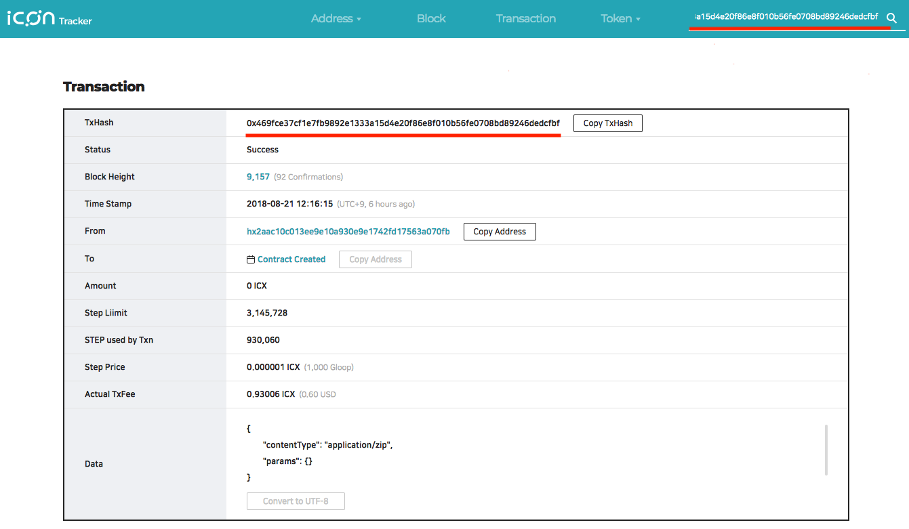

위의 화면에서 "Contract Created"를 선택하면 해당 SCORE의 상태를 확인할 수 있다. Auditor가 audit하기 전에는 아래와 같이 Pending으로 보여진다.

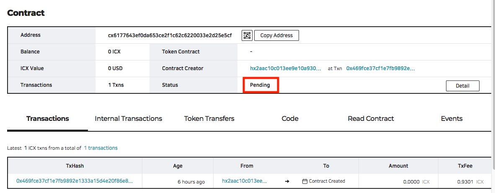

tbears 에서 해당 transaction hash값으로 transaction의 결과를 조회할 수 있는데, deploy되었다는 것만 확인 가능하다.
```bash
 (work) $ tbears txbyhash 0x469fce37cf1e7fb9892e1333a15d4e20f86e8f010b56fe0708bd89246dedcfbf
 Transaction: {
    "jsonrpc": "2.0",
    "result": {
        "version": "0x3",
        "from": "hxdfa6882cc1eff62a9714f24a3c070eb2f62fa9fc",
        "value": "0x0",
        "stepLimit": "0x300000",
        "timestamp": "0x57423de042ca4",
        "nid": "0x3",
        "nonce": "0x1",
        "to": "cx0000000000000000000000000000000000000000",
        "data": {
            "contentType": "application/zip",
            "content": 생략,
            "params": {}
        },
        "dataType": "deploy",
        "signature": "lcxudmeYzguYxMI0ggqlImKfX6CtRh5G76sG9eqzexZzLT4S56YOTCaf1H5WdmcZznVo8prsnpMeBsVAs8X1mwA=",
        "txHash": "0x469fce37cf1e7fb9892e1333a15d4e20f86e8f010b56fe0708bd89246dedcfbf",
        "txIndex": "0x0",
        "blockHeight": "0x1857f",
        "blockHash": "0x8214316329767353b9669265e2490a8c41a0889930eaaa11ddf5db096f937c0c"
    },
    "id": 1
}
```

tbears에서 SCORE address값으로 score api를 확인할 수 있는데, 해당 SCORE가 active가 아닌 경우(Pending or Rejected) 에는 아래와 같이 결과가 에러이다.

```bash
(work) $ tbears scoreapi cx6177643ef0da653ce2f1c62c6220033e2d25e5cf
Can not get cx6177643ef0da653ce2f1c62c6220033e2d25e5cf's API
{
    "jsonrpc": "2.0",
    "error": {
        "code": -32602,
        "message": "SCORE is inactive: cx1e0135cff7fa06be17840badc9ad7144b4c82606"
    },
    "id": 1   
}
```
Auditor가 audit결과로 accept를 하면, SCORE의 상태가 active로 변경되며, tracker의 SCORE조회 화면에서 상태가 active로 변경된 것을 확인할 수 있다.
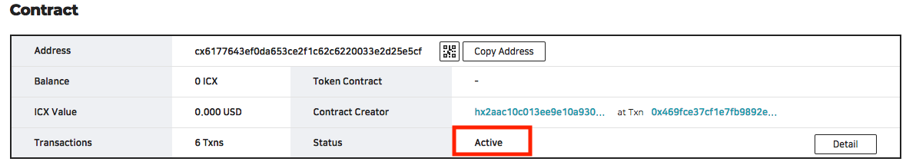

Active 상태의 SCORE를 tbears scoreapi 명령어로 조회하면 아래와 같이(내용은 다를 수 있음) 정상적으로 조회된다.
```
(work) $ tbears scoreapi cx6177643ef0da653ce2f1c62c6220033e2d25e5cf
SCORE API: [
    {
        "type": "fallback",
        "name": "fallback",
        "inputs": []
    },
    {
        "type": "function",
        "name": "hello",
        "inputs": [],
        "outputs": [
            {
                "type": "str"
            }
        ],
        "readonly": "0x1"
    }
]
```

Active 상태의 SCORE는 ICON 네트워크에서 동작하게 된다.  

### tbears deploy update
Active 상태의 SCORE에 대해서 동일한 지갑을 가지고 update를 할 수 있다.

tbears config 파일(tbears_cli_config.json)에서 deploy mode를 update로 설정하거나 명령어에서 지정한다.

```text
"deploy": {
    "mode": "update",
}
```

```bash
(work) $ tbears deploy -m update -o cx6177643ef0da653ce2f1c62c6220033e2d25e5cf abc

input your key store password:

Send deploy request successfully.

transaction hash: 0x95fd26a68ea60fe223a9a80cf5a54ab0cb7a895d65fa4836a2fc74380b230c54
```
tracker 수정 후 화면 캡쳐 추가 예정
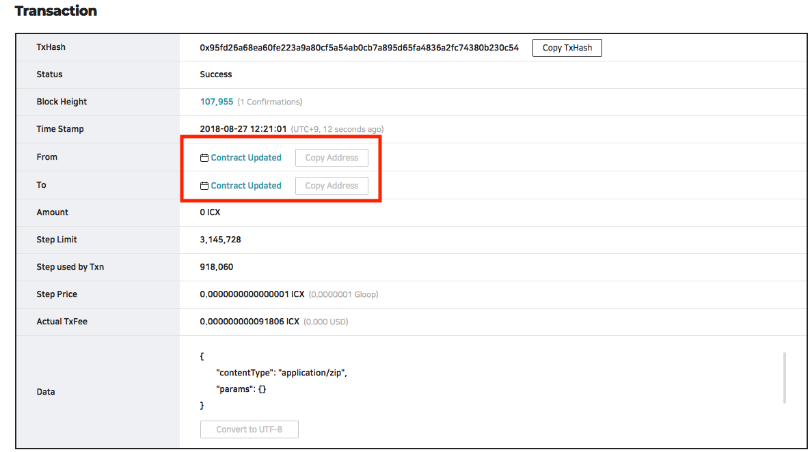

위의 화면에서 Contract Update를 클릭하면, 해당 SCORE 의 상세 화면을 볼 수 있다. 이전의 SCORE의 상태인 Active를 볼 수 있으며, transaction 리스트에서 "Contract Updated"를 확인할 수 있다.

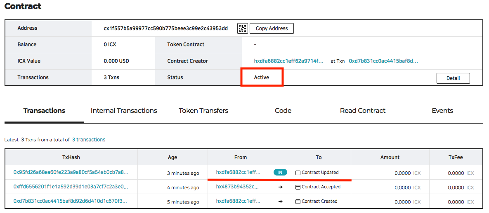

## Audit Rejected
Audtor에 의해 SCORE가 reject 되면, SCORE 조회 화면에서 다음과 같이 확인할 수 있다.

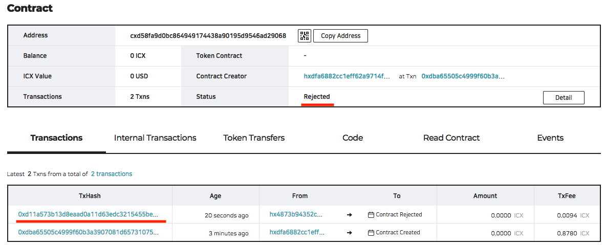
Reject 상세 이유는는 reject transaction에서 사유를 확인할 수 있다.

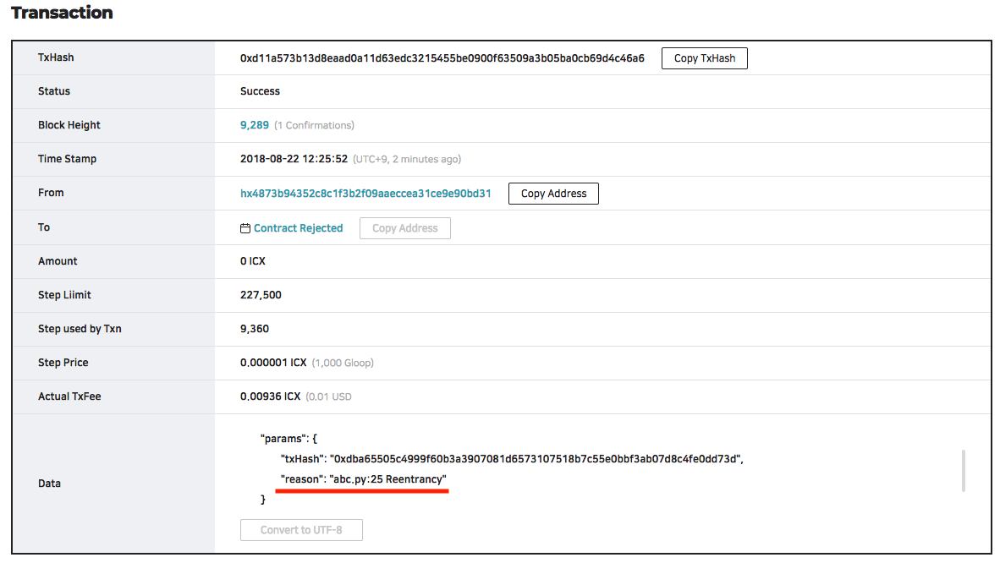
tbears scoreapi는 최종 activte된 SCORE를 반환한다. 

## TroubleShooting
1. 수수료를 지불할 수 없는 경우

```bash

(work) $ tbears deploy abc

input your key store password:

Got an error response
{'jsonrpc': '2.0', 'error': {'code': -32600, 'message': 'Out of balance'}, 'id': 1}
```

2. deploy update 시 다른 지갑을 사용하였을 경우
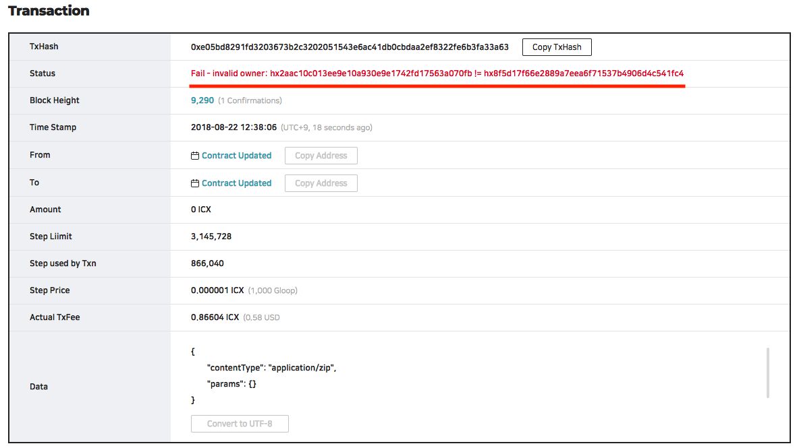

3. active 가 아닌 상태의 SCORE를 deploy update하였을 경우

```bash

(work) $ tbears deploy -m update -o cx06a427d41e87612c27c3caa2f1d7444c69781dc9  abc

input your key store password:

Got an error response

{'jsonrpc': '2.0', 'error': {'code': -32600, 'message': 'cx06a427d41e87612c27c3caa2f1d7444c69781dc9 is inactive SCORE'}, 'id': 1}

```
